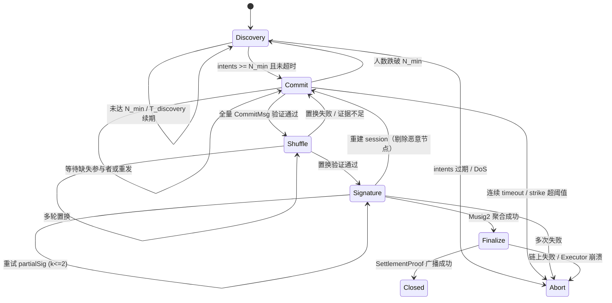
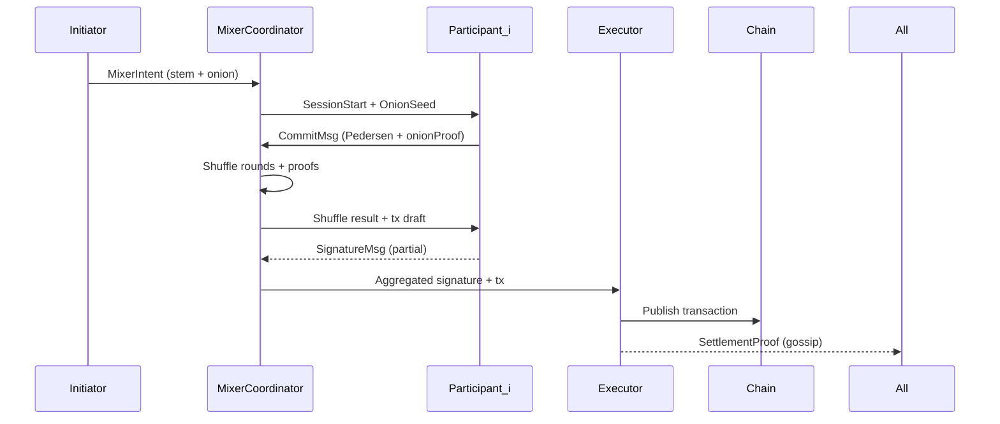

# CoinJoin + Onion D1 评审包

> 目标：自研 CoinJoin + Onion 协议在进入 D2（密码学实现）之前，完成需求建模、威胁模型与测试计划的评审。所有细节来源于 `docs/dex_bridge_design.md` 第 9.4–9.5 节。

## 1. 范围与成功标准
- 覆盖参与者角色、状态机、消息格式、密码学参数、Blame / 超时策略。
- 明确匿名性指标、威胁模型、测试矩阵，确保上线前可验证“无法追踪 + 路径不可重建”目标。
- 输出评审结论与待办，作为 D2 启动前的唯一入口。

## 2. 交付概览

| 子任务 | 状态 | 交付物 | 引用 |
| --- | --- | --- | --- |
| D1.1 消息 Schema + 密码学参数 | ✅ | `MixerIntent` / `SessionStart` / `CommitMsg` 等字段、Pedersen / Musig2 / HKDF 参数 | `docs/dex_bridge_design.md` §D1.1 |
| D1.2 Blame & 超时策略 | ✅ | 超时、黑名单、DoS 防护流程与 `BlameReport` 证据格式 | `docs/dex_bridge_design.md` §D1.2 |
| D1.3 状态机 & 时序图 | ✅ | 状态转移条件、Mermaid 状态图 + 成功时序 | `docs/dex_bridge_design.md` §D1.3 |
| D1.4 匿名性指标 + 威胁模型 + 测试矩阵 | ✅ | 匿名性阈值、攻击面缓解、测试矩阵 | `docs/dex_bridge_design.md` §D1.4 |
| D1.5 评审包 & sign-off | ⚙️ 进行中 | 本文档 + 评审 checklist | 本文 |

## 3. 需求摘要

### 3.1 角色与阶段
- 角色：Initiator、Mixer Coordinator、Participants、Escrow/Executor、Observers。
- 状态：`Discovery → Commit → Shuffle → Signature → Finalize → Closed`，任一阶段可根据超时/举报退回或 Abort。
- 所有消息经 Dandelion++ stem（启用 onion 秘钥），并由 GossipSub 随机扩散。

### 3.2 状态机与时序

## 4. 消息 Schema & 密码学参数（摘录）

| 消息 | 核心字段 | 约束 |
| --- | --- | --- |
| `MixerIntent` | `sessionHint`, `asset`, `amount`, `maxDelayMs`, `hopCount`, `proofDigest`, `initiatorPk` | Initiator 使用 Ed25519 签名；存在 stem 阶段 |
| `SessionStart` | `sessionId`, `participants[]`, `slotSize`, `feeRate`, `onionSeeds[]` | Coordinator 签名并广播，`onionSeed` 经 HKDF 派生 per-hop secret |
| `CommitMsg` | `commitment`, `nonce`, `onionProof` | Pedersen（secp256k1），blinding = SHA256(peerSeed, nonce) |
| `ShuffleMsg` | `round`, `shuffledList`, `proof` | Chaum-Pedersen 证明置换合法 |
| `SignatureMsg` | `txDigest`, `partialSig` | Musig2 / FROST 聚合；k<=2 重试 |
| `BlameReport` | `accusedId`, `stage`, `evidence` | 需附 commit / gossip snapshot / proof of absence |
| `SettlementProof` | `chain`, `txId`, `proofDigest`, `timestamp` | Executor 发布并与锁仓证明匹配 |

密码学选择：Pedersen + Bulletproof 兼容参数、Chaum-Pedersen shuffle 证明、Musig2（首选）或 Ed25519 FROST、HKDF + SHA256 派生 onion hop secret、HMAC-SHA256 校验 onionProof。

## 5. Blame / 超时策略
- 固定 `T_discovery=5s`、`T_commit=8s`、`T_shuffle=10s`、`T_sign=8s`（可调）。
- `soft timeout = deadline - 1s`，Coordinator 提醒；hard timeout触发 `BlameReport(stage=timeout)`。
- Strike 阈值 3（可配置），触发黑名单或额外抵押。
- 恶意 shuffle/commit/partialSig 均要求附证据；DoS 通过 rate limit + session cap +押金缓解。

## 6. 匿名性指标与威胁模型

### 6.1 指标
| 指标 | 目标 |
| --- | --- |
| `N_min` / `N_target` | ≥5 / ≥10 |
| 金额离散度 `Δ` | ≤2% |
| `Route TTL` | 30s（15–60s 可调） |
| `Slot churn` | ≤1/3 |
| `Blame strike` 阈值 | 3 |
| `Intent freshness` | ≤ `T_discovery` |

### 6.2 威胁与缓解
| 攻击面 | 说明 | 缓解 |
| --- | --- | --- |
| Sybil | 控制大部分 slot | pnet + 意向速率限制 + 押金/信誉 |
| Coordinator 作恶 | 串改或泄露顺序 | 全量签名、公开 `ShuffleProof`、Observers 审核 |
| Onion 关联 | 通过 relay 关联 stem | Dandelion++ + per-session hop 秘钥 + hpservice 盲中继 |
| 链上分析 | 输入输出匹配 | 固定 slot、统一手续费、必要时 dummy output |
| 重放/重签 | 重放旧消息 | 单调 `sessionId` + nonce/hopProof + strike |
| Flood / DoS | 滥用 gossip/http | Bandwidth manager、intent rate limit、并行 session cap |

## 7. 测试矩阵（D2/D3 需落实）

| 层级 | 场景 | 责任团队 | 工具 |
| --- | --- | --- | --- |
| Crypto 单测 | Pedersen / Musig2 / HKDF / Onion peel | Crypto Core | `tests/coinjoin/testprotocol.nim` |
| 协议仿真 | Commit→Shuffle→Sign happy path + timeout + blame | Privacy WG | `tests/coinjoin/test_fsm.nim` |
| 网络集成 | gossip + hpservice + `/dex/mixer` HTTP | DEX Core | `examples/dex/mixer_service.nim` + `tests/integration/testcoinjoinflow.nim` |
| 故障注入 | Drop/Delay/Replay/Coordinator crash | Reliability | `tests/integration/testcoinjoinflow.nim --scenario=delay` |
| 观察性 | Metrics/log 匿名化 | Ops | `nimble test -d:libp2p_metrics_anonymized` |

CI 要求新增 `coinjoin` target，并在 release 前补 fuzz job（针对 Shuffle/Signature 解析）。

## 8. 评审清单
1. D1 内容是否覆盖所有威胁场景？是否还需补充经济惩罚/押金合约细节？
2. 匿名性指标是否满足当前业务合规（可附外部要求）？
3. 测试矩阵是否可在 CI/CD 内执行？需要哪些 mock / stub？
4. D2 依赖是否明确（库、团队资源、代码所有权）？
5. 评审通过标准：安全、隐私、产品三方 sign-off → 将 `docs/dev_plan.md` D1 状态置 ✅ 并打开 D2。

## 9. 待办（进入 D1.5）
- 安排评审会议，参会人：Privacy WG、DEX Core、Bridge、Security、Ops。
- 根据评审结论更新本文件与 `docs/dex_bridge_design.md`/`docs/dev_plan.md`。
- 通过后：创建 D2 issue/epic，初始化 `libp2p/crypto/coinjoin.nim` 骨架与测试模板。

## 10. 评审执行计划与记录

| 步骤 | Owner | 截止 | 说明 | 状态 |
| --- | --- | --- | --- | --- |
| R1 安排评审会 | Program Owner | 2025-03-18 | 发送议程、准备 `docs/D1_review.md` 投影片 | ✅ (见 `docs/D1_review_minutes.md`) |
| R2 评审会议 | Privacy WG | 2025-03-19 | 按章节走查，现场记录整改项 | ✅ (纪要见 `docs/D1_review_minutes.md`) |
| R3 整改闭环 | 各 Owner | 2025-03-20 | 在本表附录列明整改 → 负责人 → ETA | ⚙️ 进行中（参见纪要中的 Rectify Items） |
| R4 Sign-off | Program Owner | 2025-03-20 | 更新本节状态为 ✅，并在 `docs/dev_plan.md` 标注 D1 完成 | ✅ (签字见纪要 §5) |
| R5 D2 Kickoff | Crypto Core + DEX Core | 2025-03-21 | 将 Kickoff 笔记链接回本节 | 待执行 |

> 会议纪要见 `docs/D1_review_minutes.md`；完成整改后请更新本节状态并在上表备注。

#### Rectify 状态（截至 2025-03-18）

| # | 描述 | 状态 | 备注 |
| --- | --- | --- | --- |
| 1 | 经济惩罚/押金策略补充 | ✅ | `docs/dex_bridge_design.md` 新增 “经济惩罚与押金策略” 小节 |
| 2 | `tests/coinjoin/test_shuffle.nim` & `test_signature.nim` 骨架 | ✅ | 文件已提交（参考 `tests/coinjoin/` 目录） |
| 3 | `docs/metrics.md` CoinJoin 指标 | ✅ | 文档新增 “CoinJoin 监控指标” 小节 |
