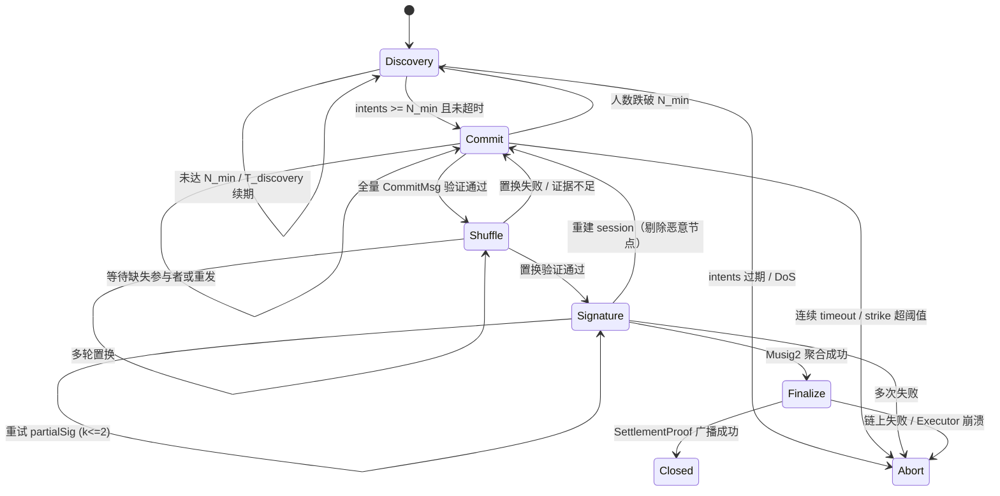
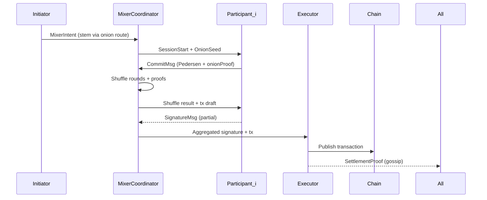

# 基于 nim-libp2p 的 DEX 与跨链桥方案

## 1. 目标与假设
- 构建依托 nim-libp2p 的去中心化交易与跨链桥网络，确保撮合、结算、资产跨链在弱联网环境下保持高可用与隐匿性。
- 充分复用仓库现有能力（`libp2p/switch.nim`、`libp2p/protocols/pubsub/gossipsub.nim`、`libp2p/protocols/datatransfer/datatransfer.nim`、`libp2p/protocols/kademlia/kademlia.nim`、`libp2p/pnet.nim` 等），避免重复造轮子。
- 假设目标公链具备智能合约或轻客户端验证接口，节点可运行 Nim 2.0/2.2，且允许部署 PoW/PoS 侧链的轻量证明。

## 2. 现有能力映射
- **网络栈与构建器**：`libp2p/builders.nim` 提供 `SwitchBuilder` 挂载 Noise/TLS、Yamux/Mplex、多种 transport（TCP/QUIC/WebSocket/Tor）、AutoNAT/Relay/Hole Punching 服务，用于搭建基础 overlay。
- **发布订阅**：`libp2p/protocols/pubsub/gossipsub.nim` 与 `libp2p/protocols/pubsub/episub/episub.nim` 支持 GossipSub v1.1、HyParView 视图维护，可实现订单广播与隐匿扩散。
- **点对点请求**：`libp2p/protocols/http/http.nim`、`libp2p/protocols/fetch/fetch.nim`、`libp2p/protocols/datatransfer/datatransfer.nim` 提供 request-response、键值拉取和大文件传输通道。
- **DHT 与存储**：`libp2p/protocols/kademlia/kademlia.nim` 内置 Provider 表、IPNS 刷新；`libp2p/providers/bitswapadvertiser.nim`、`libp2p/protocols/bitswap/*.nim`、`libp2p/protocols/graphsync/*.nim` 支持块分发与内容寻址。
- **隐私与防护**：`libp2p/pnet.nim` 私有网络、`libp2p/protocols/secure/noise.nim`、`libp2p/protocols/secure/tls.nim` 双层加密；`libp2p/resourcemanager.nim`、`libp2p/bandwidthmanager.nim` 实现 per-peer/per-protocol 限额。
- **可观测性**：`libp2p/services/metricsservice.nim` 与 `libp2p/services/otelmetricsservice.nim` 导出 Prometheus/OTLP 指标，协助运维监控。

## 3. 系统总体架构
- **Overlay 网络**：基于 `SwitchBuilder` 启用 Noise+TLS、Yamux/Mplex、AutoNAT V2 (`libp2p/protocols/connectivity/autonatv2`) 与 Circuit Relay (`libp2p/services/hpservice.nim`)；私网域使用 pnet PSK + Tor/QUIC transport 组合提升隐匿性。
- **发现与拓扑**：公共层通过 Kademlia DHT 发布撮合节点与桥服务记录，内部关键节点使用 Rendezvous (`libp2p/protocols/rendezvous/rendezvous.nim`) 维护命名空间 TTL/配额，结合 Episub 的主动/被动视图分层管理。
- **订单与状态通道**：GossipSub 主题划分 `dex.orders`、`dex.liquidity`、`dex.matches`；复杂数据（报价簿、结算证明）走 DataTransfer + GraphSync/Bitswap 通道。
- **执行组件**：
  - `Matcher/Dealer`：订阅订单主题，通过 request-response 协商交易。
  - `Settlement Executor`：链下节点调用链上 `SettlementAgent` 合约，将状态广播回网络。
  - `Bridge Watcher`/`Bridge Signer`：分别监听源链事件、生成证明/阈值签名；Signer 子网以 pnet 隔离并利用 Noise XX 流通协议消息。

## 4. DEX 核心流程
1. **订单发布**  
   - 客户端离线签名订单，通过 `dex.orders` GossipSub 主题广播；结合 `BandwidthManager.groupStats` 控制速率，并注入噪声订单提升流量均匀性。
   - 需要持久化的订单摘要可通过 `Switch.bitswapTopDebtors` 监控带宽负载，并在 `AutoProviderBlockStore` 里调用 Kad DHT `provide` 增强可用性。
2. **流动性发现与撮合**  
   - 做市节点监听 `dex.orders`，在 `dex.liquidity` 主题公布可成交深度；Identify Push (`libp2p/protocols/identify.nim`) 会同步其带宽能力，撮合节点据此筛选优先级。
   - 双方通过 `libp2p/protocols/http/http.nim` 或自定义 request-response 协议建立加密流，确认价格、滑点、保证金等细节。
3. **链上结算**  
   - 双方向所属链 `SettlementAgent` 提交承诺，链下执行节点使用 DataTransfer channel（`libp2p/protocols/datatransfer/channelmanager.nim`）发送证明与必要的 GraphSync 区块。
   - 合约触发事件后，Watcher 借助 GossipSub `dex.matches` 主题和 signed envelope (`libp2p/signed_envelope.nim`) 通知双方状态。
4. **回滚与仲裁**  
   - 若超时或证明无效，链上合约根据超时与挑战流程返还资金；网络側通过 DHT 记录异常订单，供未来匹配过滤。

## 5. 跨链桥交互流程
1. **锁定与监听**  
   - 源链部署 `Gateway` 合约。Watcher 节点通过链节点或轻客户端组件监听事件，利用 Bitswap/GraphSync 保留原始区块数据。
2. **证明打包与传播**  
   - 结合链类型选择 SPV、ZK Light Client 或乐观证明。证明与元数据封装为 DataTransfer voucher，借助 GossipSub/Fetch 发布索引引用，对外传播仅暴露必要摘要。
3. **阈值签名**  
   - `Bridge Signer` 通过私有 pnet overlay 与 Noise XX 洽谈，使用仓库的 request-response API 搭建 DKG/TSS 协调通道。可引入 `libp2p/protocols/datatransfer` 的控制事件保证消息可靠送达。
4. **目标链执行**  
   - 执行节点向目标链 `Gateway` 提交证明或阈值签名。若失败，引导挑战者通过 `dex.bridge.exec` 主题广播异常，结合链上时间锁回滚。

## 6. 安全与隐匿策略
- **通信安全**：默认启用 Noise + TLS；关键角色采用 pnet + TorTransport (`libp2p/transports/tortransport.nim`) 或 QUIC (`libp2p/transports/quictransport.nim`) 降低指纹化风险。
- **拓扑隐匿**：使用 Circuit Relay v2 (`libp2p/services/hpservice.nim`) 作为盲转发；节点周期性刷新 `PeerId`，并借助 Rendezvous TTL 控制外部可发现窗口。
- **流量对抗**：GossipSub 消息加入随机延迟与 cover traffic；DataTransfer 通道可通过 `resourceSnapshot` 动态调整带宽限额，避免流量峰值暴露。
- **身份准入**：结合 `libp2p/peerstore.nim` 的 MetadataBook 维护白名单；Signer/Matcher 可要求外部节点提交带签名的 VC 证明后加入。
- **测量与报警**：MetricsService/OtelMetricsService 导出撮合延迟、Bitswap 债务、AutoNAT 状态等指标，日志在本地加密并设置保留策略。

## 7. 部署与运维建议
- 利用 `examples/libnimlibp2p.nim` 快速生成节点配置，脚本化启用 `autonat`、`relay`、`rendezvous`、`pnet`。
- 建议建立三层环境：开发（本地内网 + memory transport）、测试网（rendezvous + auto-relay）、生产（多区域 Tor/QUIC + pnet）。
- 结合 `docs/metrics.md` 的指标列表，自定义告警阈值（撮合成功率、跨链证明时间、ResourceManager 限额占用等）。

## 8. 后续迭代方向
- 接入特定公链轻客户端/证明库，并在 nim-libp2p 的 DataTransfer voucher 中定义标准化 payload。
- 扩展 GossipSub + Episub 的策略，利用 Identify 广播的带宽信息做动态 mesh 调整（参考 `docs/pubsub-episub.md`）。
- 设计集成测试：使用 `tests/kademlia/testfindnode_enabled.nim`、`tests/pubsub/integration/testgossipsubskipmcache.nim` 等模板构建 DEX/桥端到端模拟。

## 9. USDC → 基于 libp2p 的比特币支付网络隐私设计
USDC 从 EVM 链（或跨链包装资产）进入比特币支付网络后，会落在一个复合栈：前半段是桥接/兑换（DEX + `examples/bridge` 里的 watcher/signer），后半段是基于 libp2p 的 off-chain 支付网络（Lightning-like overlay）。隐私目标主要包括 **无法追踪** 与 **阻断交易路径重建** 两类攻击面。

### 9.1 无法追踪（Untraceability）
- **资金混淆**：桥接完成后，先在目标链或侧链中执行 CoinJoin/协作混币。可以借助 `libp2p/protocols/pubsub/gossipsub.nim` GossipSub 主题协调一批 UTXO，同步广播混币会话参数，再由离线批量签名完成交易；混币前后在 `examples/bridge/bridge/storage.nim` 里记录匿名标识，避免用户端与真实输入一一对应。
- **保密交易**：若支付网络落在支持 RingCT/Pedersen Commit 的比特币扩展层（例如 Mimblewimble sidechain），则在数据传输层通过 `libp2p/protocols/datatransfer` 传递承诺向量和环签名，仅暴露验证必需的哈希。`libp2p/signed_envelope.nim` 可包裹零知识证明，防止中继节点窥探金额。
- **零知识证明**：在 bridge→支付网络的入口，要求节点提交 zk-SNARK/zk-STARK 证明，说明“该笔资金来自有效的 USDC 锁定事件”而不包含地址细节。证明可以作为 DataTransfer voucher，自定义 `proofType = zkLockWitness`，供目标链合约或支付通道验证。
- **边缘混淆**：DEX/桥接阶段通过单边流动性池或聚合路由（见 `examples/dex/production_kline_design.md:200+`）打碎大额 USDC，结合多次闪兑/批处理，减少入口端被机器学习关联的概率。

### 9.2 防止交易路径重建
- **匿名多跳路由**：libp2p overlay 中默认开启 Noise/TLS，但仍需引入洋葱路由。可基于 `libp2p/transports/tortransport.nim` 或内置 Relay v2，把支付通道更新封装成 onion packet，每跳节点只得知上/下游 PeerId；失败重试时刷新 session key，防止关联攻击。
- **隐私 Gossip（Dandelion++）**：支付指令先进入 stem 阶段（单路径随机转发），随后扩散为 fluff 阶段。该策略与 GossipSub 兼容：在 `MeshBuilder` 上添加 stem-mode 标记，或利用 Episub 的主动视图控制首跳，降低网络层时间关联。
- **元数据去标识**：`libp2p/identify.nim` 默认为所有节点广播公钥和倾向传输地址。隐私支付子网需禁用 identify push、周期性轮换 PeerId/Transport，多用匿名 relay 地址；并借助 `libp2p/pnet.nim` 以及自定义 metadata 过滤器，阻止收集节点抓取 IP。
- **支付通道机密**：Lightning 风格 HTLC/贝叶斯路由在 Nim 侧可写于 `examples/bridge/services/executorservice.nim` 或独立模块，每次路由建立 onion packet + per-hop secret。失败路径不返回完整路由，只传递 error code，阻断被动监听者推断完整路径。

### 9.3 网络必须具备的能力
- **模块化通信栈**：`SwitchBuilder` 组合 Noise、TLS、Yamux/QUIC、pnet，为匿名传输提供基础。特定支付角色（路由器、出入口）可加载 TorTransport 或 WebRTC transport（移动端）。
- **隐私增强路由**：在 `libp2p/services/hpservice.nim`（Hole Punch + Relay）上层实现随机多跳、盲中继策略；结合 `libp2p/providers/bitswapadvertiser.nim` 控制可见性，减少 DHT 上的记录。
- **加密原语集成**：需要 Ring Signature、Pedersen Commitment、zk-SNARK 等库的 FFI（可以放在 `examples/mobile_ffi/libnimlibp2p.nim` 暴露 API），并在 Nim 层统一密钥管理，避免泄露。
- **跨链隐私接口**：桥接合约/Watcher 需支持原子交换或 zk-bridge 证明，`bridge/services/bscwatcher.nim`、`bridge/services/executorservice.nim` 可扩展加入“隐私锁仓 ID”，只公开哈希引用。
- **抗分析运维**：Metrics/日志默认匿名化，敏感节点关闭持久日志；对 `libp2p/resourcemanager.nim` 的限流策略进行随机化，防止流量模式被推断。

上述策略并非绝对安全，但在 nim-libp2p 框架下组合运用，可显著提升 USDC → BTC 支付网络的抗分析能力，也为后续引入 FHE、TEE 等更强隐私手段预留接口。

### 9.4 落地任务拆分与依赖
| 任务编号 | 能力目标 | 主要修改点 | 产出 / 验证 | 依赖 | 进度 |
| --- | --- | --- | --- | --- | --- |
| P1 | GossipSub / Dandelion++ 隐私扩散 | `libp2p/protocols/pubsub/gossipsub.nim` 和 Episub mesh builder 引入 stem/fluff 状态机，新增 `-d:libp2p_privacy_gossip` flag 与 `tests/pubsub/testgossipsubprivacy.nim` | 可配置 stem 延迟 + 覆盖率指标，CI 单测通过 | 既有 GossipSub 1.4 行为评分 | ✅ 已完成（见 `libp2p/protocols/pubsub/gossipsub*.nim`、`tests/pubsub/testgossipsubprivacy.nim`） |
| P2 | 洋葱路由 + Relay 盲中继 | 新建 `libp2p/protocols/onionpay`；扩展 `libp2p/services/hpservice.nim` 盲中继管道，`examples/bridge/services/executorservice.nim` 集成 onion packet 构造 | `examples/dex/dex_node` 3-hop demo & `tests/onion/testonionpay_path.nim` | Relay V2、Noise/TLS 栈 | ⚙️ 进行中：`libp2p/protocols/onionpay.nim`、`tests/onion/testonionpay*.nim` 已覆盖多跳/tamper 场景，Executor 通过 `enableOnionDemo` 打印 route，hpservice/示例间转发待完成 |
| P3 | zk 锁仓证明入口 | `bridge/services/bscwatcher.nim` 调用新建 `bridge/services/zkproof.nim` 生成 `proofType = zkLockWitness` voucher，扩展 `examples/bridge/bridge/storage.nim` schema | 证明 CLI + `tests/test_bridge_storage.nim` 扩展场景 | 选定 zk 库/外部 prover | ✅ 已完成（`bridge/services/zkproof.nim`、Watcher/Signer/Executor/Storage 全面接入，`tests/test_bridge_storage.nim`/`tests/test_bridge_executor.nim` 验证） |
| P4 | CoinJoin/混币协调 | `examples/dex/dex_node` 增 `dex.mixers` 主题，借 `libp2p/protocols/http/http.nim` 协议交换混币参数；`examples/bridge/services/executorservice.nim` 写入匿名标签 | `examples/dex/scripts/run_coinjoin_demo.sh`、storage 匿名标签 | 依赖 P3 匿名标识 | ⚙️ 进行中：`dex_node` 加入 Mixer CLI/`dex.mixers` Gossip + `/dex/mixer` HTTP route，周期性广播混币请求并打印计划，尚待示例脚本与 Executor 存储匿名标签 |
| P5 | 指标与运维匿名化 | `libp2p/services/metricsservice.nim` / `libp2p/metrics_exporter.nim` 提供匿名模式（PeerId hash、刷新时间随机化），`docs/metrics.md` + `examples/dex/.env` 补 flag | `nimble test -d:libp2p_metrics_anonymized` 通过，Prometheus 不含明文 PeerId | MetricsService gcsafe 改造 | ⏸ 未启动（依赖 Resource/Metrics gcsafe 重构完成） |

- **推进顺序**：优先网络层（P1、P2）→ 证明入口（P3）→ 资金流混淆（P4）→ 运维匿名（P5）。
- **验证策略**：新增单元测试 + 示例脚本；在沙箱复现“桥接混淆→隐私 gossip→洋葱支付”的端到端链路。

> P4 目前落地的内容：`examples/dex/dex_node.nim` 增加 `--enable-mixer`、`--mixer-interval`、`--mixer-slots` 等参数，节点会在 `dex.mixers` Gossip 主题广播混币请求，并在本地挂载 `/dex/mixer` HTTP 路径返回 slot 调度方案（使用 `lpHttp.HttpService` 承载）。Matcher/Trader 通过日志即可看到「请求 → HTTP 计划 → 响应」完整链路，为后续与桥 Executor 的匿名标签写入/脚本化演示（`examples/dex/scripts/run_coinjoin_demo.sh`）打下基础。

### 9.5 CoinJoin / Onion 自研方案设计

| 阶段 | 目标 | 主要交付 | 依赖 |
| --- | --- | --- | --- |
| D1 需求建模 | 定义 CoinJoin/Onion 参与者、状态机、消息格式、失败/惩罚机制 | 协议设计文档（状态图、时序图）、攻击模型与测试大纲 | 业务方匿名性指标、现有 gossip/onionpay 能力 |
| D2 密码学原型 | 自研或改进 KE/承诺/签名/Shuffle 流程，完成最小可行 CoinJoin + Onion | `libp2p/crypto/coinjoin.nim`、`tests/coinjoin/testprotocol.nim`（覆盖 Commit→Sign→Reveal、Onion hop 验证） | nimcrypto/HMAC 等基础原语 |
| D3 网络与可靠性 | 将 D2 协议嵌入 gossip + HTTP，处理重试/退出/DoS，并提供模拟器 | `examples/dex/mixer_service.nim`、`tests/integration/testcoinjoinflow.nim`（多节点 + 故障注入） | D2 |
| D4 审计与优化 | 形式化验证、安全审计、性能与资源调优 | 审计报告、Benchmark 脚本、失败注入测试 | D1~D3 |
| D5 生产护栏 | 与存储/结算/监控集成，提供 runbook + 告警策略，完成演练 | 运维手册、指标/告警列表、演练记录 | D4 + 运营团队 |

执行原则：

1. **先规范后实现**：D1 文档通过安全/产品评审后方可编码，规范需覆盖匿名性指标、对抗场景（DoS/Sybil/超时）、退出与惩罚逻辑。
2. **可依赖基础原语**：可使用 nimcrypto 等底层库，但 CoinJoin/Onion 的高层协议与状态机须自研并附带测试与说明。
3. **测试策略**：覆盖单元（密钥、承诺、混洗、hop 验证）、协议模拟（多节点、网络抖动、超时）、集成（桥 + DEX + Mixer），并在 CI 中加入长期 fuzz/stress job。
4. **审计与验收**：D4 前需完成独立审计并记录修复计划；上线前与运营/风控联合演练。
5. **文档同步**：每个阶段完成后更新本节及 `docs/dev_plan.md`，保持研发/业务/安全对齐。

#### D1 需求建模（草案 v0.1）

**参与者与角色**
- `Initiator`：用户端或桥 Watcher，将金额 `A` 兑换为匿名输出并触发 CoinJoin 会话；
- `Mixer Coordinator`：负责收集参与者意向、生成混币计划（slot/schedule）、驱动会话状态机；
- `Participants`：与 Initiator 等价但互不信任的 N 个匿名节点，通过 gossip/onion 交换 Commit/Reveal；
- `Escrow/Executor`：在会话完成后生成最终交易（BTC/USDC），并广播到目标链或下游；
- `Observers`：不参与资金交换，只验证 gossip 状态和指标。

**状态机概览**
1. `Discovery`：通过 `dex.mixers` gossip 发布 `MixerIntent`（金额、资产、过期时间）。Coordinator 聚合到达阈值 `N_min` 的 intent 后进入下一状态；
2. `Commit`：Coordinator 广播 `SessionStart`（包含 sessionId、参与者列表、slot 信息、onion route seeds）。每个参与者提交 `PedersenCommit(amount, blinding)`；
3. `Shuffle`：Coordinator 执行或协助执行多轮 shuffle（Fischer-Yates + HMAC 验证），得出随机顺序的输出列表；期间通过 onion 路由传输中间结果；
4. `Signature`：所有参与者对混币交易的草稿（inputs/outputs + fee）进行 Schnorr/EdDSA 多签；若某参与者超时或作恶，则广播 `BlameReport` 并重新进入 `Commit`；
5. `Finalize`：Coordinator/Executor 将最终交易发布到链上，同时在 gossip 中广播 `SettlementProof`（链上 txId + zkLockWitness digest），桥端记录匿名标签。

**消息/字段（示例）**
- `MixerIntent`：`{sessionHint, asset, amount, maxDelayMs, onionHopCount, proofDigest}`
- `SessionStart`：`{sessionId, participants[], slotSize, feeRate, onionSeeds[]}`
- `CommitMsg`：`{sessionId, participantId, pedersenCommit, nonce, onionHopProof}`
- `ShuffleMsg`：`{sessionId, round, shuffledList, proof}`
- `SignatureMsg`：`{sessionId, txDigest, partialSignature}`
- `BlameReport`：`{sessionId, accusedId, evidence}`（例如未签名、发送错误 shuffle）
- `SettlementProof`：`{sessionId, chain, txId, proofDigest}`

**失败与超时策略**
- Discovery 超时：Coordinator 取消或降级会话（减少 slot 或合并下批）；
- Commit/Shuffle 阶段若有人缺失或发送不一致数据，Coordinator 记录并在 `BlameReport` 中附上事实（Commit 比对、shuffle hash）；
- Signature 阶段若有缺失，回滚到 Commit 或直接 abort；
- 参与者被多次举报可被列入本地黑名单，需提供押金或额外证明后方可重新加入；
- 所有阶段均需设置 `T_max`（例如 5s/10s/30s），以防止 DoS。

**匿名性与安全指标**
- 至少 `N_min=5` 个参与者，优先满足 `N_target=10`；
- 单个会话的输入输出金额差异（除手续费外） ≤ `Δ`，避免金额指纹；
- Coordinator 对外仅暴露 sessionId 与统计结果，不保留明文顺序；
- On-chain 交易使用统一 fee 模式，避免通过 fee 推断；
- 所有消息需使用 onion route + Dandelion++ 扩散以掩盖来源。

接下来在 D1.1/D1.2 中将进一步细化消息 schema、签名方式、onion hop 密钥派生与 `BlameReport` 的证据格式。完成后同步至 `docs/dev_plan.md` 并提交评审。

#### D1.1 消息 Schema 与密码学参数

| 消息 | 字段 | 说明 / 类型 | 安全要求 |
| --- | --- | --- | --- |
| `MixerIntent` | `sessionHint` (uint64)、`asset` (string)、`amount` (uint64, 8 decimals)、`maxDelayMs` (uint32)、`proofDigest` (hex32)、`hopCount` (uint8)、`initiatorPk` (32-byte Ed25519) | 存在于 Dandelion stem 阶段；`proofDigest` 对应锁仓/桥证明摘要 | Initiator 对整个 payload 做 Ed25519 签名，便于后续 blame |
| `SessionStart` | `sessionId` (uint64 monotonic per coordinator)、`participants` (list of peerId/pk)、`slotSize` (uint16)、`feeRate` (uint32 sat/vbyte)、`onionSeeds` (list of 32-byte) | Coordinator 广播；参与者可用 `onionSeeds[i]` + HKDF 生成 hop secrets | Coordinator 用自身 ed25519 签名，避免伪造 |
| `CommitMsg` | `sessionId`、`participantId`、`commitment` (Pedersen: 32-byte base + 32-byte blinding)、`nonce` (8-byte)、`onionProof` (HMAC over hop secrets) | 所有参与者在 `T_commit` 内提交 | Pedersen 采用 secp256k1 PedersenCommit，blinding 来自 SHA256(kdf(peerSeed, nonce)) |
| `ShuffleMsg` | `sessionId`、`round` (uint8)、`shuffledList` (array of commitments)、`proof` (Chaum-Pedersen) | 使用串行/并行 shuffle，至少 2 轮 | 每轮输出附带 zero-knowledge proof，证明列表为原列表的置换 |
| `SignatureMsg` | `sessionId`、`txDigest` (32-byte)、`partialSig` (Schnorr/EdDSA) | 生成最终交易 | 采用 Musig2（secp256k1）或 Ed25519-multisig；所有 partialSig 最终聚合成单签 |
| `BlameReport` | `sessionId`、`accusedId`、`stage`、`evidence` | 由 任意参与者发起，Coordinator 验证后广播 | `evidence` 例如：对比 commit、显示缺失消息、提供签名不匹配；必须包含 accused 签名或其缺席证明（如 Gossip snapshot） |
| `SettlementProof` | `sessionId`、`chain`、`txId`、`proofDigest`、`timestamp` | 由 Executor 广播 | `proofDigest` 必须与初始锁仓/桥证明匹配；`txId` 在链上可验证 |

**密码学参数**
- `PedersenCommit`：基于 secp256k1，采用 Bulletproof/Ristretto 兼容参数，便于未来升级；
- `ShuffleProof`：采用 Chaum-Pedersen + Hash transcript（Fiat-Shamir）；
- `Signature`：优先 Musig2（Schnorr），若依赖 Ed25519 则采用 FROST；
- `OnionHop Secret`：`secret_i = HKDF(onionSeed_i, sessionId || participantId || hopIndex)`，用于 onionpay；
- 所有 Hash 使用 SHA256，HMAC 使用 HMAC-SHA256；
- 时间参数：`T_discovery = 5s`、`T_commit = 8s`、`T_shuffle = 10s`、`T_sign = 8s`（具体待调优）。

#### D1.2 Blame 机制与超时策略

- **缺席/超时**：若某参与者在 `T_commit/T_shuffle/T_sign` 内未提交消息，Coordinator 记录并发起 `BlameReport(stage=timeout)`，随后将其从 session 移除并标记 `strike+1`；达到阈值 (默认 3) 列入黑名单。
- **无效承诺**：若 CommitMsg 的 Pedersen commitment 与后续 Reveal/Signature 不匹配，必须附上原 commitment、相关签名和 mismatch 证据；Coordinator 验证后将 accused 加入黑名单。
- **恶意 Shuffle**：若 ShuffleMsg 的 `proof` 验证失败，Coordinator 即刻终止该轮并广播 `BlameReport(stage=shuffle)`，同时回滚到上一正确信列表。
- **签名阶段抽退**：若 partial signature 无效或缺失，Coordinator 可重试 `k` 次（默认 2），仍失败则终止 session 并在 `SettlementProof` 中标注失败原因。
- **DoS 防护**：限制每个参与者的并行 session 数，采用押金/信誉（可由外部合约或存储模块实现）；在 gossip 层对频繁的 `BlameReport`/`MixerIntent` 做速率限制。

#### 经济惩罚与押金策略

| 项目 | 说明 |
| --- | --- |
| 押金额度 | `collateral = max(5% * slotAmount, 0.02 BTC)`；`slotAmount` 指本次 CoinJoin 输入金额的上限。Initiator 在广播 `MixerIntent` 前需提供押金承诺（`collateralCommit`），并在桥合约 `MixerCollateralVault` 中锁定资产。 |
| 锁定方式 | 通过桥合约或链下 Escrow（`Escrow/Executor` 角色）锁定；`MixerIntent` 携带 `collateralProofDigest`（zkLockWitness 哈希），Coordinator 在 `SessionStart` 时校验。 |
| 罚没触发 | 1) `BlameReport(stage=commit/shuffle/signature)` 被 ≥2/3 参与者佐证；2) 超时超过两轮（`strike >= 2`）；3) 提交无效 Pedersen/partialSig 或广播恶意 Shuffle 结果。 |
| 罚没比例 | 默认为 50% 进入公共惩罚池（补贴协调费用），50% 平均分配给受影响会话的其它参与者；对于重复违规（30 天内 ≥2 次）直接罚没 100% 且列入黑名单。 |
| 退还条件 | 会话成功 `Finalize` 且无 `strike` 记录，押金在链上确认 `SettlementProof` + `ReleaseCollateral` 事件后自动解锁；若会话因 Coordinator 故障终止，由 Program Owner 审批后退还。 |
| 资金用途 | 惩罚池资金用于补贴测试/审计费用，余额由 Program Owner 定期审计，记录在 `examples/dex/mixer_service.nim` 暴露的指标中。 |
| 透明度 | 所有押金相关操作产生 `CollateralLocked` / `CollateralSlashed` / `CollateralReleased` 事件，并由 Watcher 通过 `dex.collateral` Gossip 主题同步，供参与者验证。 |

#### D1.3 状态机与时序图

**状态定义与转移条件**
- `Discovery` → `Commit`：`MixerCoordinator` 累计满足 `participants.len >= N_min` 且所有 `MixerIntent` 均在 `T_discovery` 以内；若超时，则取消或降级 slot（`slotSize = floor(current/2)`）。
- `Commit` → `Shuffle`：所有入选参与者提交 `CommitMsg`，Coordinator 验证 Pedersen 承诺与 `onionProof`；缺失节点触发 `BlameReport(timeout)` 并被剔除，若人数低于 `N_min` 则回退 `Discovery`。
- `Shuffle` → `Signature`：至少完成 2 轮 Chaum-Pedersen 置换并收敛于稳定输出列表，若任何一轮 proof 校验失败则回滚至上一轮并对责任方发起 `BlameReport(shuffle)`。
- `Signature` → `Finalize`：Musig2/FROST 聚合签名成功并由 Executor 生成交易草稿；若 `partialSig` 缺失则回退 `Commit`（携带新 `slotSize = existingParticipants`）或直接 `Abort`。
- `Finalize` → `Settlement`（链外）→ `Closed`：Executor 推送链上交易并广播 `SettlementProof`，桥模块根据 `proofDigest` 写入匿名标签；若链上确认失败则记录 `FinalizeFailed` 并通知参与者重试。

**Mermaid 状态图**

**成功时序（含 Onion 路由）**

每个阶段均记录 `enterTimestamp` 与 `deadline = enterTimestamp + T_phase`，Coordinator 在 `deadline - Δ` 时广播 “soft timeout” 以提醒慢节点；`Δ` 默认 1 秒。

#### D1.4 匿名性指标、威胁模型与测试矩阵

**匿名性指标**

| 指标 | 目标/阈值 | 说明 |
| --- | --- | --- |
| `N_min` / `N_target` | ≥5 / ≥10 | 少于 5 直接取消；不足 10 需在 SettlementProof 中标注以评估风险 |
| 金额离散度 `Δ` | ≤ 2%（相对差异） | 输入 = 输出 + 统一手续费，避免通过金额推断 |
| `Route TTL` | 30s 默认（可 15~60s） | 超过 TTL 即重新选择 stem 路由，降低流量关联 |
| `Slot churn` | ≤ 1/3 | 单轮剔除节点不超过三分之一，避免频繁重组泄露 |
| `Blame strike` | 阈值 3 | 超过阈值即 require collateral / 黑名单 |
| `Intent freshness` | ≤ `T_discovery` | 超时 Intent 不可复用，防止重放 |

**威胁模型与缓解**

| 攻击面 | 描述 | 缓解手段 |
| --- | --- | --- |
| Sybil 参与者 | 攻击者批量发送 `MixerIntent` 控制多数 slot | `N_min` + pnet 过滤 + 押金/信誉；对同一 EKYC 标签设置并发上限 |
| Coordinator 作恶 | 串改顺序或泄露承诺 | 所有消息签名 + `ShuffleProof` 公证；Observers 可验证 Event Log |
| Onion 路由关联 | 通过宠幸节点关联 stem 流量 | Dandelion++ + onion hop seeds 每 session 轮换；hpservice 盲中继不保留日志 |
| 链上金额分析 | 通过输入输出金额匹配 | 统一 slot size + 手续费模板 + 必要时 dummy output |
| 重放/重签 | 重放旧 Commit 或 Signature | sessionId 单调递增 + nonce/hopProof + strike 追踪 |
| Flood/DoS | 恶意节点耗尽 Gossip/HTTP | 带宽 manager + intent rate limit + per-peer session cap |

**测试矩阵**

| 层级 | 场景 | 类型 | 工具/入口 |
| --- | --- | --- | --- |
| Crypto 单测 | Pedersen/Musig2/HKDF/Onion peel | unit | `tests/coinjoin/testprotocol.nim` |
| 协议仿真 | Commit→Shuffle→Sign happy path + timeout + blame | simulation | 新增 `tests/coinjoin/test_fsm.nim`（多节点模拟） |
| 网络集成 | Gossip stem/fluff + hpservice 盲中继 + `/dex/mixer` HTTP | integration | `examples/dex/mixer_service.nim` + `tests/integration/testcoinjoinflow.nim` |
| 故障注入 | Drop/Delay/Replay/Coordinator crash | chaos | `tests/integration/testcoinjoinflow.nim --scenario=delay` |
| 观察性 | Metrics/log 匿名模式验证 | e2e | `nimble test -d:libp2p_metrics_anonymized` |

所有测试需在 PR CI 引入 `coinjoin` target，并在 release 前增加 fuzz job（针对 Shuffle/Signature 解析）。

#### 下一步

- 将上述 schema/参数同步至 `docs/dev_plan.md` 并立项评审；
- `docs/D1_review.md` 已整理全部 D1 产出，准备发起评审；
- 评审通过后进入 D2：实现 `libp2p/crypto/coinjoin.nim`、`tests/coinjoin/testprotocol.nim`，并在 `examples/dex/mixer_service.nim` 原型化网络流程。

#### D2 密码学原型计划（预备）

> 目标：在评审通过后 3 周内完成自研 CoinJoin/Onion 的密码学实现，输出可复用 API 与最小可行测试套件，为 D3 网络整合提供稳定基座。
> **前置条件**：`docs/D1_review.md` 评审结论已记录且整改项关闭；Program Owner 发出 D2 Kickoff 公告（参见 `docs/dev_plan.md` 20.6）。

**层次化实现**
1. `libp2p/crypto/coinjoin/commitments.nim`  
   - 封装 Pedersen 承诺、blinding 生成、承诺相减/相加与 range 校验；  
   - 提供 `func pedersenCommit(amount: UInt256, blind: Scalar): Commitment`、`proc verifyCommit(commit, amount, blind): bool` 等接口。
2. `libp2p/crypto/coinjoin/shuffle.nim`  
   - 实现 Chaum-Pedersen 置换证明与 transcript；  
   - API：`proc proveShuffle(listIn, listOut, secret): ShuffleProof`、`proc verifyShuffle(..): bool`。
3. `libp2p/crypto/coinjoin/signature.nim`  
   - Musig2/FROST 聚合、nonce 协调与抗重放缓存；  
   - API：`proc startAggregation(sessionCtx, pubKeys)`、`proc processPartial(partial)`.
4. `libp2p/crypto/coinjoin/onion.nim`  
   - HKDF + HMAC 派生 hop secret，并生成/剥离 onion payload；  
   - API：`proc deriveHopSecrets(seed, sessionId, participantId, hops)`、`proc buildOnionLayer(ctx, payload)`.
5. `libp2p/crypto/coinjoin/session.nim`  
   - 组合以上模块，驱动 `Discovery→Finalize` 的纯算法仿真；  
   - 输出 `CoinJoinSessionState`、`proc step(event)`，供测试与上层调用。

**任务拆解（D2.x）**

| 任务 | Owner | 内容 | 验收 |
| --- | --- | --- | --- |
| D2.1 承诺与密钥派生 | Crypto Core | Pedersen 实现、HKDF/HMAC 封装、onion seed KDF | `tests/coinjoin/test_commitments.nim` 通过（覆盖正/负例） |
| D2.2 Shuffle 证明 | Crypto Core | Chaum-Pedersen 置换 + transcript +序列化 | `tests/coinjoin/test_shuffle.nim`（包含错序/伪造） |
| D2.3 Musig2/FROST 聚合 | Privacy WG | 多签 session 管理、nonce 轮换、抗重放 | `tests/coinjoin/test_signature.nim`（k<=2 retries） |
| D2.4 会话模拟器 | DEX Core | `CoinJoinSession` 聚合 commit/shuffle/signature，输出中间事件 | `tests/coinjoin/testprotocol.nim`、`test_fsm.nim` |
| D2.5 Fuzz & Bench | Reliability | 针对 Shuffle/Signature 的 fuzz harness + micro benchmark | Fuzz job 稳定 12h 无崩溃，性能报告 |

**依赖与注意事项**
- 仅依赖 `nimcrypto`, `stew/bigints`, `chronos`；禁止引入外部 CoinJoin 库。
- 所有 API 需 `raises: []` 或显式声明，方便上层异步调用。
- 模块默认 `when defined(libp2p_coinjoin)` 才编译，可逐步集成。

**验收标准**
- 所有 D2.x 单测+仿真在 CI 通过（`nimble test coinjoin`）。
- Fuzz 覆盖 shuffle/proof 序列化 ≥ 90% 分支。
- 文档：在本节追加 “D2 验收记录” 表格，并将运行命令写入 `docs/dev_plan.md`。

**核心数据结构（草案）**
- `CoinJoinCommitment`：`type CoinJoinCommitment = object`，字段 `point: array[32, byte]`、`blind: array[32, byte]`；提供 `proc serialize`/`deserialize`。
- `ShuffleProof`：包含 `challenge: Scalar`、`responses: seq[Scalar]`、`transcriptHash: array[32, byte]`。
- `MusigSessionCtx`：保存 `pubKeys: seq[PublicKey]`、`aggNonce`, `aggKey`, `usedNonces: Table[PeerId, NonceState]`。
- `OnionRouteCtx`：`seed: array[32, byte]`、`hopSecrets: seq[array[32, byte]]`、`payload: seq[byte]`、`mac: array[32, byte]`。
- `CoinJoinSessionState`：`id`, `phase`, `participants`, `commits`, `shuffleState`, `signatureState`, `timeouts`.

**接口约定**
- 所有 `prove/verify` API 返回 `Result[void, CoinJoinError]`，避免异常造成上下文泄露。
- `CoinJoinSession.step(event)` 输入 `MixerIntent`, `CommitMsg`, `ShuffleMsg`, `SignatureMsg` 等结构体，输出 `SessionEffect`（包括 `BroadcastMessage`, `BlameReport`, `FinalizeTx` 等枚举），利于未来在网络流程中直接消费。
- `Onion` 模块为同仓 `libp2p/protocols/onionpay.nim` 提供 `proc toOnionPacket(routeCtx, payload: seq[byte]): OnionPacket` 与 `proc fromOnionPacket(...)`.

**D2 验收记录（待填）**

| 日期 | 项目 | 负责人 | 结论/链接 |
| --- | --- | --- | --- |
| 2025-03-24 | D2.1 承诺/密钥派生 | Crypto Core | 初版 Pedersen/HKDF/onionProof 代码与 `tests/coinjoin/test_commitments.nim` 已推送，`nimble testcoinjoin --define:libp2p_coinjoin` 因离线依赖（pebble/bearssl）待 CI 网络环境补跑 |
| - | D2.2 Shuffle 证明 |  |  |
| - | D2.3 Musig2/FROST |  |  |
| - | D2.4 会话模拟器 |  |  |
| - | D2.5 Fuzz & Bench |  |  |

> 完成每个 D2.x 任务后，请在此表中填入日期/负责人/PR 链接，并同步 `docs/dev_plan.md` 对应状态。

**当前进展（2025-03）**
- 已提交 `libp2p/crypto/coinjoin{types,commitments,shuffle,signature,onion,session}.nim` 骨架，以及 `tests/coinjoin/testsuite.nim` 与 `nimble testcoinjoin` 任务，确保 D2 代码有统一入口与可编译的占位实现。
- 默认情况下 CoinJoin 代码以 `-d:libp2p_coinjoin` 开关控制；在未启用时 API 返回 `cjDisabled`，便于逐步集成。运行局部测试示例：`nimble testcoinjoin --define:libp2p_coinjoin`.

**D2.1 细节（Pedersen + HKDF/HMAC）**
- Pedersen 基点：沿用 secp256k1 `G`（标准生成元）与 `H = hash_to_curve("coinjoin-blind")`，实现中通过 `secp256k1_ec_pubkey_create` + `sha256` 衍生；`H` 需缓存以避免重复 hash-to-curve。
- 承诺计算：`Commit = amount * G + blind * H`，其中 `amount` 以 64-bit 定点编码，再扩展为 secp256k1 `Scalar`；`blind` 通过 `HKDF-SHA256(masterSeed, "blind"|sessionId|nonce)` 生成。
- Range 校验：先行实现 “balance-only” 校验（验证 `Commit - amount*G == blind*H`），D2.1 后续计划引入 Bulletproof/Folded 证明（D2.1.1 扩展）。
- 接口现状：
  - `encodeAmount(uint64)` 将定点金额编码为 32-byte big-endian，`generatorMul(amount)` 负责 `amount*G`；
  - `hkdfBlind(seed, sessionId, nonce)` 输出 32-byte 盲因子，`pedersenGeneratorMul(blind)` 负责 `blind*H`；
  - `pedersenCommit`/`verifyCommitment`/`addCommitments`/`subtractCommitments` 提供承诺生成、校验与加减闭环；
  - `combineKeys`/`negateKey`/`addBlinds`/`subBlinds` 等 helper 暴露给上层实现 blame/重试逻辑。
  - `tests/coinjoin/testsuite.nim` 在 `-d:libp2p_coinjoin` 下覆盖 roundtrip（commit → verify）及加减闭环。
- 接口：`pedersenCommit`, `verifyCommitment`, `addCommitments`, `subtractCommitments`；所有接口返回 `CoinJoinResult`，遇到无效输入返回 `cjInvalidInput`，底层 secp 错误映射为 `cjInternal`。

**D2.2 细节（Shuffle 证明）**
- 当前实现：`proveShuffle` 校验输出是否为输入的排列（使用 CountTable），并基于 `commitmentsHash` 生成 transcript（输入/输出/合并 hash）；`ShuffleProof.responses = [hash(inputs), hash(outputs)]`，`challenge = hash(inputs ++ outputs)`，`verifyShuffle` 重建哈希后确认 permutation，作为 D2.2 的可执行占位。后续可将 transcript 替换为真正 Chaum-Pedersen 证明。
- 验证流程：1) 校验非空且长度一致；2) 重建 transcript 并比对 `responses/challenge`；3) 使用 CountTable 确认 outputs 为 inputs 的置换。
- 子任务：D2.2.a Transcript 设计、D2.2.b Fisher-Yates 构造器、D2.2.c Chaum-Pedersen 证明、D2.2.d 错误映射、D2.2.e 性能基准；详见 `docs/dev_plan.md` 20.4.2。

**D2.1 里程碑与后续扩展**
- 已完成：`libp2p/crypto/coinjoin/secp_utils.nim` 提供 Pedersen 基点 `H = hash_to_curve("coinjoin-blind")`、盲因子 HKDF、sec p 公钥 combine/mul/neg/盲加减；`commitments.nim` 实现 `pedersenCommit/verify/add/subtract` 与 `encodeAmount`；`tests/coinjoin/testsuite.nim` 在 `-d:libp2p_coinjoin` 下验证 roundtrip 与加减闭环。
- D2.1.a：`derivePedersenBase`（secps `G/H`）+ 测试；D2.1.b：金额编码；D2.1.c：HKDF blind；D2.1.d：commit/verify/add/sub；D2.1.e：balance-only 校验；D2.1.f：记录 Bulletproof/Folded 计划。
- D2.1.g：需要在 `libp2p/crypto/secp` 或新建 `coinjoin/secp_utils` 中暴露 scalar→secret、`pubkey_tweak_add/mul` 等 helper，以支撑 Pedersen 计算；参见 `docs/dev_plan.md` 20.4.1。
- D2.1.1 预研：选择 Bulletproofs or Halo 证明栈，评估 `nim-bulletproofs` 或自研实现的投入（待 D2.1 完成后立项）。
- 当前进度：`libp2p/crypto/coinjoin/{commitments,secp_utils,onion}.nim` 已提供 Pedersen/HKDF、`OnionRouteCtx`、`deriveHopSecrets`、`onionProof`、`buildOnionPacket`/`peelOnionLayer`、以及与 `libp2p/protocols/onionpay.nim` 的 `toOnionPacket`/`fromOnionPacket` 互转，`tests/coinjoin/test_commitments.nim` 覆盖 roundtrip/篡改/跨模块桥接；受限于本地离线依赖，`nimble testcoinjoin --define:libp2p_coinjoin` 需在联网 CI 上补跑。

**D2.3 细节（Musig2/FROST）**
- Musig2 为默认路径：依赖 secp256k1 的 Musig2 扩展（若后续引入第三方依赖需通过 vendoring），短期内可使用库内 `secp256k1` + 自实现聚合流程；Design：`startAggregation -> nonce exchange -> partial verify -> finalize`.
- FROST 备用路径：针对 Ed25519 节点；协议结构与 Musig2 相同，但依赖 `ed25519` 多签 aggregator。实现期望在 D2.3 分支中引入 feature flag。
- 子任务：D2.3.a Musig2 Context、D2.3.b Nonce 防重放、D2.3.c Partial 验证、D2.3.d Finalize、D2.3.e FROST 兼容、D2.3.f Metrics；详见 `docs/dev_plan.md` 20.4.3。

**D2.4 细节（Session FSM 模拟器）**
- `CoinJoinSessionState` 需要追踪 per-phase 超时（`phaseDeadline: Time`）、commit/shuffle/signature intermediate results、blame strike。
- `stepSession` 输入 `SessionEvent`（待实现，包括 `Intent`, `Commit`, `Shuffle`, `Signature`, `Timeout`, `Failure` 等），输出 `SessionEffect`（`Broadcast`, `BlameReport`, `FinalizeTx`, `Abort`）。
- 模拟器将调用 D2.1/D2.2/D2.3 实现，生成 deterministic 日志，供 D3 网络栈复用。
- 子任务：D2.4.a SessionEvent 定义、D2.4.b Phase Deadline、D2.4.c Strike & Blame、D2.4.d Effect 生成、D2.4.e 集成钩子；详见 `docs/dev_plan.md` 20.4.4。
